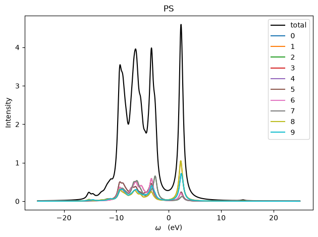
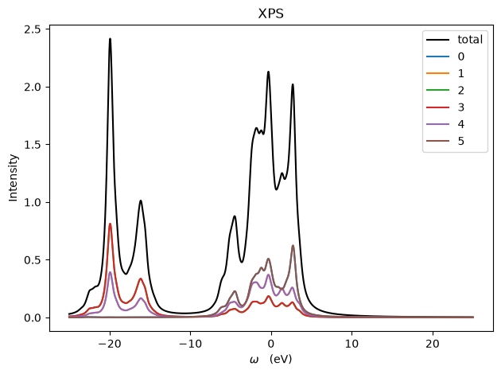
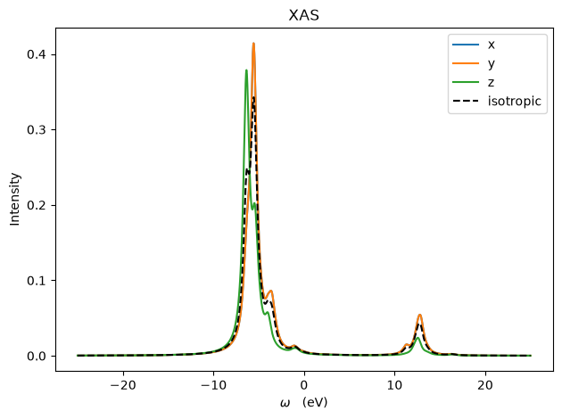
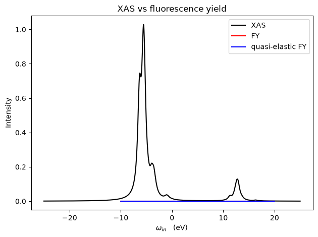

## XAS calculations in RSPt
With RSPt we can calculate core-level spectra using the Multiplet Ligand Field Theory
(MLFT) method. This is a method that is very similar to using Exact Diagonalization as a
solver for the DMFT problem, but we don't need to do any self consistent calculations or
calculate any self-energies.

## Required Python packages
To perform the XAS simulations we need to use two python packages for preparing the input for the calculations and for performing the calculations.

### impurityModel
The code used to do the MLFT calculations is called impurityModel. The code is freely
available on github.
There are unfortunately 3 different versions of the MLFT code available

1. [The original version (not maintained very regularly anymore)](https://github.com/JohanSchott/impurityModel)
2. [My version, maintaned regularly, also usable as a DMFT solver](https://github.com/johanjoensson/impurityModel)
3. [Another version, based on the original but with some added spectra to calculate](https://github.com/fesorg/Tutorial-X-ray-from-RSPt)

All of the above can be installed rather straight forwardly using a Python virtual environment.
I will assume that you are using my version from now on.

### rspt2spectra
rspt2spectra is a python package used to parse RSPt data (hamiltonians, out files, hybridization functions, etc.) and perform the
numerical bath fitting of the hybridization function required by impurityModel. There are 2 versions available:

1. [The original version](https://github.com/JohanSchott/rspt2spectra)
2. [My version](https://github.com/johanjoensson/rspt2spectra)

Just like impurityModel, I will assume that you are using my version from now on.

## Basic setup
We will calculate the XAS spectra of paramagnetic (or nonmagnetic) NiO. This is a small and quick calculation but it will include all the step required for more complicated calculations.
Set up the calculation just as [before](../NiO_PM/nio_pm.html), but use Fermi smearing and a smearing of $0.0019$ Ry (~300 K), remember to update the dE/W as well. Converge the SCF calculation.


## The MLFT Hamiltonian
The first thing we need to determine for our XAS caluclation is the Hamiltonian to use. The MLFT
Hamiltonian looks similar to the DMFT hamiltonian, but it has a few extra terms that need to be determined.


### The local Haltonian and hybridization function
We need to do a single calculation of the valence states hybridization function. This is very similar to a DOS calculation using the `green.inp` method.
```
inputoutput
 F F         # We don't need to read any selfenergy, nor do we do a SCF calculation

energymesh
 1001 -1.0 1.0 0.010  # nemesh  emin emax eim

verbose
 Dump   # Might be needed to make the code include offdiagonal elements in the hybridization function

spectrum
 Hyb Proj # We need the orbital resolved hybridization function

cluster
 1 0 IdNi_d  # norb U? Identifier
 1 2 1 1 0   # t l e site basis
```

After doing a single RSPt iteration the code should produce the files `real-hyb-Ni_d.dat` and `imag-hyb-Ni_d.dat`, and the out file should contain the `Local hamiltonian` for our Ni\_d cluster.

`rspt2spectra` provides a script to extract the local Hamiltonian and hybridization function from the RSPt output files, and prepare them for the MLFT calculation. You can use the following command to do this:

```bash
build_h0 --bath-geometry star --eim 0.010 --gamma 0.001 --plot Ni_d 1
```

The build\_h0 script will extract the Ni\_d local hamiltonian from the `out` file, and read the `real-hyb-Ni_d.dat` and `imag-hyb-Ni_d.dat` files to obtain the continuou hybridization function.
It will then perform a numerical bath fitting procedure to obtain a set of discrete bath levels that approximate the continuous hybridization function. The discretized hybridization function is
returned in a `star` geometry (the choice of geometry is important for the calculations, but it should not affect the results you obtain in the end). The `eim` parameter should match
the value used to set up the real frequency mesh in `green.inp`. The `gamma` parameter is a regularization parameter used in the bath fitting procedure, and should be set to a small value (0.001 is a good starting point).
The `--plot` flag tells the script to produce plots of the continuous and discretized hybridization funcitons so that we can evaluate the fit ourselves. The final two arguments are the `cluster ID` to extract,
and the number of bath states to fit per orbital in the cluster. In our case we fit the `Ni_d` cluster, and we use 1 bath orbital per orbital in the cluster. 10 orbitals in a d-shell, means 10 bath orbitals, for a total of 20
spin orbitals in our calculation. This is a very low number, but we want the calculations to run quickly for this tutorial. The calculations become exponentially heavier with increasing number of spin orbitals.
The code can probably handle 5 bath states per orbital without too much issue, and on a supercomputer even more. The computational weight will be very system dependent though.

`build_h0` will create a file called `Ni_d.h0`, this is the "operator form" of the local Hamiltonian for the Ni $3d$ states that our MLFT calculation will use.

### The spin orbit coupling parameters
First of all, we need the parameters for the core states, specifially their spin-orbit coupling.
For core states this is relatively straight forward. The SOC parameter for `2p` states in the core is `3/2`
times the energy difference between the states (the core states will be split into 2 groups, $\kappa = -2$, and $\kappa = 1$).
In our case the Ni `2p` states are at energies $~-61.56$ Ry, and $~-60.28$ Ry, meaning a split of $~1.28$ Ry, and a SOC parameter of $~0.85$ Ry.
If you are doing a calculation with `f-rel` in the data file
set to `t` you don't need to do anything to extract the SOC parameter for the valence states, it will
already be included in your local Hamiltonian. Our calculations have not included spin orbit coupling, so we will set
`f-rel` to `t` now. Then perform a single non SCF calculation to extract the spin orbit coupling parameters for the Ni `3d` states.
For NiO the effects of spin-orbit coupling are small, so the exact treatment here is not super important.


All we need is a simple `green.inp` that will print the local hamiltonian
```
inputoutput
 F F         # We don't need to read any selfenergy, nor do we do a SCF calculation

convergency
 1e-5 1e1 999 0 # We only need the calculation to find the Fermi energy and not crash.

cluster
 1 0 IdNi_d  # norb U? Identifier
 1 2 1 1 0   # t l e site basis
```

The SOC parameter for d-orbitals is easy to identify in the spherical harmonics basis (`basis` tag `0`), it is the element (6, 2) in the local Hamiltonian (6th row, 2d column). For us it is
`0.00811414716` Ry, small as we expected.

### The Coulomb matrix
For the MLFT calculations we need to set up a somewhat involved Coulomb matrix, because we need it to include
the valence electron-electron interactions (just like in DMFT), but also the core-valence interaction (the core hole
will affect the valence states) must be included. To do this we create a new folder, called `coulomb` and copy the `data`, `pot`, `eparm`, `spts`, `symcof`, and `green.inp` files into it.
We will now move into the coulomb folder and modify the `data` file.

In order to calculate the coulomb interaction between the `2p` and `3d` states we need to move the `2p` states into the valence, by switching them with the `2p` core states. To do this we just change the Ni element to the following:
```
 TYPE 1: species: 28a
   natom   nharm  (L=   0   1   2   3   4   5   6   7   8)
       1       4  (n=   1   1   1   1   2   2   3   3   4)
 (/ (24i3))
 density exponents
  1
 basis exponents
  5  4  3  2  1  0  0  0  0
 (/ (3f18.0, 5x, a1))
              tau1              tau2              tau3     c
  .000000000000000  .000000000000000  .000000000000000     l
 (/ i6, 2f12.0, 5x, a1 /)
     n           S          dx coord
   543  .826648202       0.025     v
   543  2.02843440       0.025     a
 (/f6.0, i6, f12.0, 2f6.0, 2x, 2i1, f2.0, 11x, a1//(2i6, f12.0, i12))
     Z    nc      Sinf/S     . Sws/S  ....     ScoFlag
   28.     7          1.    1.    1.  10.0           p
     n     k         occ        flag
     1    -1          2.           0
     2    -1          2.           0
     3     1          2.           0
     3    -2          4.           0
     3    -1          .0           0
     2     1          .0           0
     2    -2          .0           0
    12 Bases
     0     1     1
     0     1     2
     0     1     3
     1     1     1
     1     1     2
     1     1     3
     2     1     1
     2     1     2
     0     2     1
     0     2     2
     1     2     1
     1     2     2
     4     4     3     4     5     6     7     8     9
    20    21     0     0     0     0     0     0     0
     3     2     3     4     5     6     7     8     9
    -1    -1     0     0     0     0     0     0     0
```
Note that we changed the empty `p` states in the core to be the `2p` states, and not `3p` states as before (we still keep some empty `2p` states though, this is fine).

We now need a rather special cluster to generate the U matrix:
```
inputoutput
 F F         # We don't need to read any selfenergy, nor do we do a SCF calculation

convergency
 1e-5 1e1 999 0 # We only need the calculation to find the Fermi energy and not crash.

verbose
 Umatrix

debug
 Noscreening

cluster
 2 UJ eV
 1 2 1 1 0 -1.00  # A U value of -1.00 means that we are not interested in the actual U/F0
 1 1 2 1 0 -1.00
 0 0 0.5
```
the `verbose` block with the `Umatrix` flag tells RSPt to print the full four-index Coulomb matrix to the output file. We need this because the MLFT calculation requires the explicit Slater integrals (or Coulomb matrix elements) for both the valence-valence and the core-valence interactions.

The `debug` block with the `Noscreening` flag is used to turn off the internal screening mechanisms of RSPt for this specific calculation. In MLFT, it is standard practice to use bare or purely atomic-like Slater parameters which are then scaled down manually (typically to 80%) to account for solid-state screening effects, rather than relying on the RPA or cRPA screening calculated by the DFT code.

Finally, the `cluster` block defines our two relevant states. In this example, the first line `2 UJ eV` specifies that there are 2 correlated shells in our cluster, and that we provide interactions in terms of $U$ and $J$ in eV.
- `1 1 1 1 0 -1.00`: This defines the first shell. For a transition metal, this would typically represent the core $2p$ state (principal quantum number $n=2$, angular momentum $l=1$).
- `1 2 1 1 0 -1.00`: This defines the second shell, typically the valence $3d$ state ($n=3$, $l=2$).
- `0 0 0.5`: This just means that we do everything needed for a DMFT run (calculate the U amtrix etc.) but do no such run.

```
 Slater parameters: cluster orbital set: i1,i2,i3,i4, F0 F2 F4 F6 or G1 G3 G5
    1   1   1   1 1.9760520 0.9106847 0.5652318 0.0000000
    1   1   2   2 0.3831284 0.2176499 0.0000000 0.0000000
    1   2   1   2 2.7606118 0.5178857 0.0000000 0.0000000
    1   2   2   1 0.3831284 0.2176499 0.0000000 0.0000000
    2   1   1   2 0.3831284 0.2176499 0.0000000 0.0000000
    2   1   2   1 2.7606118 0.5178857 0.0000000 0.0000000
    2   2   1   1 0.3831284 0.2176499 0.0000000 0.0000000
    2   2   2   2 8.4715310 3.9912227 0.0000000 0.0000000
```
The first 4 integers of each line are the shell indices of the $U_{ijkl}$ matrix. Shell 1 is the Ni `3d` shell, and shell to is the `2p`. The $F^{dd}$ parameters
are thus printed on the line starting with `1   1   1   1`, the $F^{pd}$ are printed on the line starting with `1   2   1   2`, the $G^{pd}$ start with `1   2   2   1`.

Reading of the Slater integrals we get (in Ry):
* $F^{dd}_{0, 2, 4}$ : 1.9760520, 0.9106847, 0.5652318
* $F^{pd}_{0, 2}$ : 2.7606118 0.5178857
* $G^{pd}_{1, 3}$ : 0.3831284 0.2176499

The values for $F^{dd}_0$ and $F^{pd}_0$ are LARGE. This is a known issue, we cannot estimate the bare interaction strengths in this way. We need some other way to do it. For $F^{dd}_0$ there are several methods, and
since the value is the `Hubbard U` value used in DFT+U and DFT+DMFT calculations it is usually quite easy to find some values in literature. For $F^{pd}_0$ however the situation is a bit worse,
there are no really decent ways to estimate this parameter from first principles. Instead we will rely on a trusted heuristic, $F^{dd}_0 + 1 eV < F^{pd}_0 < 1.3 x F^{dd}_0$.
For our calculation we will use $F^{dd}_0 = 0.55$ Ry, and $F^{pd}_0 = 0.65$ Ry.


#### An alternative way (complicated, unsafe way)
If you are the type of person who (like me) thinks "hmmm, there should be another, more complicated, less reliable, and just plain silly way to do this." This part is for you!
We can of course make the LMTO basis insanely weird and very hard to actually work with, but it will let us extract the Coulomb matrix without moving semi core states from the valence
(which I guess you can call a partial victory, if you want to). It does however probably lead to a crashed calculation, but as long as the crash happens after the Coulomb matrix was calculated,
we should be fine!

We will move the `2p` states to the valence, meaning we need to increase the `zval` by 6 (6 `2p` electrons per Ni site in the cell, 1 Ni site in the cell).
We need to introduce a separate energy set for the 2p states. By default RSPt uses 2 energy sets,
to allow us to use 3 we just change the flag `nsets` from 2 to 3. Our previous calculation put the Ni `2p` states in the core, but we need them to be in the valence for our calculation of the Coulomb U matrix.
We therefore need to modify the entry for `TYPE 1`:
```
 TYPE 1: species: 28a
   natom   nharm  (L=   0   1   2   3   4   5   6   7   8)
       1       4  (n=   1   1   1   1   2   2   3   3   4)
 (/ (24i3))
 density exponents
  1
 basis exponents
  5  4  3  2  1  0  0  0  0
 (/ (3f18.0, 5x, a1))
              tau1              tau2              tau3     c
  .000000000000000  .000000000000000  .000000000000000     l
 (/ i6, 2f12.0, 5x, a1 /)
     n           S          dx coord
   543  .826648202       0.025     v
   543  2.02843440       0.025     a
 (/f6.0, i6, f12.0, 2f6.0, 2x, 2i1, f2.0, 11x, a1//(2i6, f12.0, i12))
     Z    nc      Sinf/S     . Sws/S  ....     ScoFlag
   28.     7          1.    1.    1.  10.0           p
     n     k         occ        flag
     1    -1          2.           0
     2    -1          2.           0
     2     1          2.           0
     2    -2          4.           0
     3    -1          .0           0
     3     1          .0           0
     3    -2          .0           0
    12 Bases
     0     1     1
     0     1     2
     0     1     3
     1     1     1
     1     1     2
     1     1     3
     2     1     1
     2     1     2
     0     2     1
     0     2     2
     1     2     1
     1     2     2
     4     4     3     4     5     6     7     8     9
    20    21     0     0     0     0     0     0     0
     3     3     3     4     5     6     7     8     9
    -1    -1     0     0     0     0     0     0     0
```
First we empty the `2p` core states.
```
     Z    nc      Sinf/S     . Sws/S  ....     ScoFlag
   28.     7          1.    1.    1.  10.0           p
     n     k         occ        flag
     1    -1          2.           0
     2    -1          2.           0
     2     1          0.           0
     2    -2          0.           0
     3    -1          .0           0
     3     1          .0           0
     3    -2          .0           0
```
Then we add the `2p` states to the valence, in a third energy set:
```
    14 Bases
     0     1     1
     0     1     2
     0     1     3
     1     1     1
     1     1     2
     1     1     3
     2     1     1
     2     1     2
     0     2     1
     0     2     2
     1     2     1
     1     2     2
     1     3     1
     1     3     2
     4     4     3     4     5     6     7     8     9
    20    21     0     0     0     0     0     0     0
     3     3     3     4     5     6     7     8     9
    -1    31     0     0     0     0     0     0     0
     2     2     3     4     5     6     7     8     9
    -1    -1     0     0     0     0     0     0     0
```

We also need a third energy set for the O, this can just be an identical copy of the second energy set
```
 TYPE 2: species: 8a
   natom   nharm  (L=   0   1   2   3   4   5   6   7   8)
       1       4  (n=   1   1   1   1   2   2   3   3   4)
 (/ (24i3))
 density exponents
  1
 basis exponents
  5  4  3  2  1  0  0  0  0
 (/ (3f18.0, 5x, a1))
              tau1              tau2              tau3     c
  .500000000000000  .500000000000000  .500000000000000     l
 (/ i6, 2f12.0, 5x, a1 /)
     n           S          dx coord
   479  .704871243       0.025     v
   479  1.72961736       0.025     a
 (/f6.0, i6, f12.0, 2f6.0, 2x, 2i1, f2.0, 11x, a1//(2i6, f12.0, i12))
     Z    nc      Sinf/S     . Sws/S  ....     ScoFlag
    8.     1          1.    1.    1.  10.0           p
     n     k         occ        flag
     1    -1          2.           0
     8 Bases
     0     1     1
     0     1     2
     0     1     3
     1     1     1
     1     1     2
     1     1     3
     2     1     1
     2     1     2
     2     2     3     4     5     6     7     8     9
     0     0     0     0     0     0     0     0     0
     2     2     3     4     5     6     7     8     9
     0     0     0     0     0     0     0     0     0
     2     2     3     4     5     6     7     8     9
     0     0     0     0     0     0     0     0     0
```
Now, just change the cluster defined in `green.inp`, because the `2p` states live in energy set `3` now. Run one iteration (which will probably crash just after printing the Slater parameters), and extract
the Slater parameters just as we did above. In our case, they should be identical.


## Running the Impurity Model
Once we have all the input parameters for the MLFT calculation we can use impurityModel to calculate the XAS spextra. To do this we use the `impurityModel` master script.

```bash
impurityModel spectra --ls 1 2 --nBaths 0 10 --nValBaths 0 10 --n0imps 6 8 --Fdd 0.55 0.0 0.91 0.0 0.56 --Fpd 0.65 0.0 0.52 --Gpd 0.0 0.38 0.0 0.22 --xi_2p 0.85 --xi_3d 0.008 --chargeTransferCorrection 0.11 --T 300 --hField 0 0 0 --delta 0.03 --unit Ry  Ni_d.h0
```
And the explanation of the sometimes cryptic command line arguments:
- --ls 1 2: The angular momentum quantum numbers of the shells in our calculation. In our case, the core $2p$ shell has $l=1$, and the valence $3d$ shell has $l=2$.
- --nBaths 0 10: The total number of bath orbitals for each shell. In our case, we have 0 bath orbitals for the core $2p$ shell, and 10 bath orbitals for the valence $3d$ shell.
- --nValBaths 0 10: The number of bath orbitals that are nominally occupied (in our case all bath states are at negative energies, so all 10 are occupied).
- --n0Imps 6 8: The (nominal) number of electrons in each shell. In our case, the $2p$ shell has 6 electrons (fully filled), and the $3d$ shell has 8 electrons (for Ni).
- --Fdd --Fpd --Gpd: The Slater integrals we calculated above, and the $U_{dd}$ and $U_{pd}$ parameters we decided on as well. Note that we need to supply also the zero values (e.g. $F^{dd}_1$) on the command line, and Gpd expects 4 numbers (thus ending with a 0.0).
- --xi_2p: The spin-orbit coupling parameter for the `2p` core states.
- --xi_3d: The spin-orbit coupling parameter for the `3d` valence states.
- --chargeTransferCorrection 0.11: A correction to the charge transfer energy, used for the MLFT double counting. For transition metal oxides a value around 1.5 eV is usually good, vary it and see how the spectra changes.
- --T 300: The temperature of the calculation, in Kelvin. This is used to calculate the Boltzmann weights of the different states in the calculation.
- --delta 0.03: Lorentzian broadening of the XAS spectra. 0.03 Ry is around the usual broadening in experiments.
- --unit Ry: Tell the code that we supplied all the data in Ry, not eV.

There are more parameters that can be set, but for now this is all we need. The script will read the local Hamiltonian, set up the calculations, and calculate a bunch of stuff.
The calculated spectra will be stored in a HDF5 archive `spectra.h5`, and a few smaller `.dat` files will be generated for quick plotting. To quickly plot the calculated spectra,
impurityModel includes a plotting script.
```bash
impurityModel plot-spectra
```
Will display a bunch of figures.

For more information on what the `impurityModel` script can do, please use the `impurityModel --help` command. For information about calculating spectra `impurityModel spectra --help` will give you a list of all the available options.
And for plotting spectra `impurityModel plot-spectra --help` will give you a list of all the available options for plotting.

The plot script throws out a bunch of plots, here are the ones I got. So you have something to compare with.


Photoemission spectra, with orbital contribution as well.


X-ray photoemission spectra.


X-ray absorption spectra, linear polarizations as well as isotropic (average).


If we had calculated the RIXS (set a positive deltaRIXS) we could get another way to calculate/estimate the XAS here.

And that's it! You have successfully calculated an X-ray absorption spectrum from first principles using RSPt and MLFT. Feel free to compare your spectra with those calculated [by the original version of the code](https://arxiv.org/pdf/1706.08168)
We did not screen our Slater parameters at all, that is not the standard way to do these calculations. Also, we have slightly different setups for the calculations (kpoint mesh etc.), so the results will not be a perfect match.
